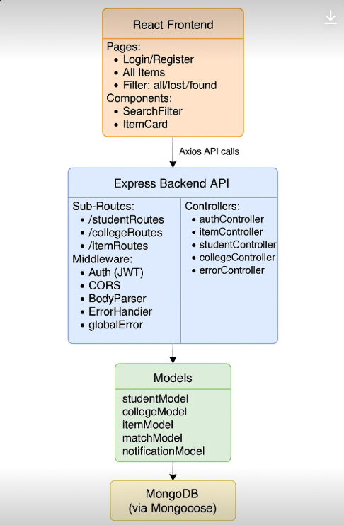

## 📦 Lost & Found Platform for Colleges

A full-stack MERN application that allows college students to post and find lost or found items. Each item is associated with a specific college. The system also includes features for user authentication, image uploads, and organized API routes.

## 🚀 Tech Stack

Frontend: React.js

Backend: Node.js, Express.js

Database: MongoDB (via Mongoose)

Authentication: JWT (JSON Web Tokens)

Image Storage: Cloudinary

## 📊 Architecture Diagram

## 🧩 Features

Student signup/login with JWT auth

Post lost/found items with image uploads

View all items by filter: all / lost / found

View and manage your own items

Cloud image storage

## 📁 Folder Structure

/client
/components
/pages
/utils

/server
/controllers
authController.js
itemController.js
studentController.js
collegeController.js
/models
itemModel.js
matchModel.js
notificationModel.js
studentModel.js
collegeModel.js
/routes
itemRoutes.js
studentRoutes.js
collegeRoutes.js
/middlewares
auth.js
errorHandler.js
/utils
catchAsync.js
AppError.js

## 🔗 API Endpoints Summary (from ROUTES.md)

## 👤 Student Routes

POST /api/students/signup — Register student

POST /api/students/login — Login and get JWT token

## 🎓 College Routes

POST /api/colleges — Create college

GET /api/colleges — Get all colleges

## 📦 Item Routes

POST /api/items — Create item (auth)

GET /api/items — Get all items (auth)

GET /api/items/myItems — Get items posted by logged-in user

GET /api/items/:id — Get item by ID

PATCH /api/items/:id — Update item

DELETE /api/items/:id — Delete item

## 🛠️ Setup Instructions

Clone the repo

Set up .env file with MongoDB URI, JWT secret, Cloudinary keys

Run backend:

cd server
npm install
npm run dev

Run frontend:

cd client
npm install
npm start

📸 Screenshots

(Add screenshots of UI once ready)

📜 License

MIT
